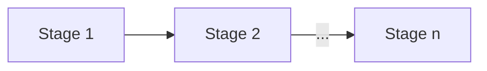
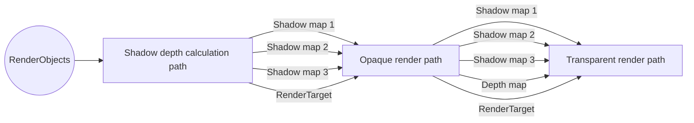

### Overview
Render engine will have a set of stages, which will be interlinked.
Each stage will have input and output ports, which will receive inputs on sink ports required for performing a stage, 
and provide output on source port.

### Stage description
Each stage will inputs and outputs should be alligned with outputs/inputs of the predecessor/sucesspor stages.
Thus inputs should be fixed in terms of rendering objects, e.g. buffers, textures, framebuffers, etc.
E.g. stage 1 requires to provide set of VertexArray buffers to preformfirst pass draw to generate and image, thus inputs would be:
* collection of objects for rendering
* default framebuffer, where rendering should be performed

The outputs would be 
* Collection of objects for rendering.
* default target for rendering, where rendering should be performed

Each stage should be able to receive multiple inputs, however interlink between the stages should guarantee, that all inputs are satisfied, thus there should be performed some nogatiation process, between source stage and sink stage, where sink stage checks provided inputs from source and accepts all or only a subset of them.
After successfull nogatiation rendering pipeline is ready for receiving inputs and processing them.

#### First iteration

At the first iteration each pipeline state will provide a set of sink and source ports, which will contain required sink and source data.
Each pipeline stage will have to be manually connected to required ports depending on the .
E.g.

Each stage performs next operations:
* Receive and update inputs form previous stage
* Perform operation as far as previous stage gives privilege to successor to do this
* Provide next stage with outputs
* Notify next stage that operation is finished, so that next stage is able to start its operation

